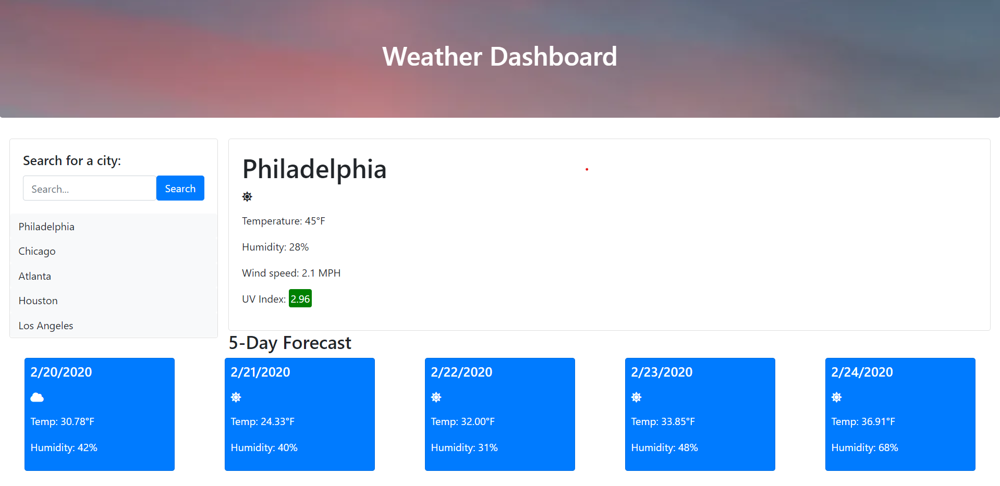

In this repository I created an application that displays the weather of the specified city. The user can search for a city, and the immediate weather details are displayed, along with a 5-day forecast of the weather. Information about the condition, temperature, humidity, and ultraviolet index are provided. When a user searches for a city, the city is added to a history of searches. The user can then use this search history to display the weather for that city.

[Here is a link to the application.](https://ethanl150.github.io/WeatherDashboard/)

